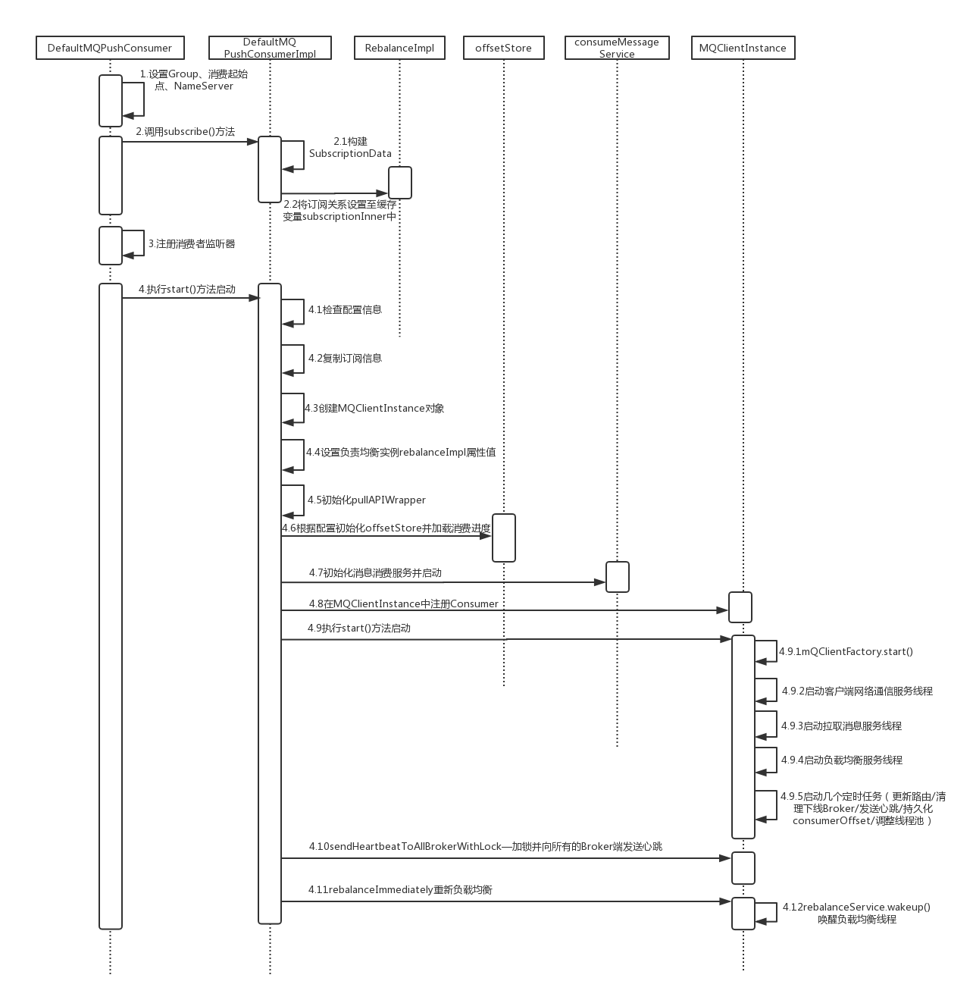

之前讲过，RocketMQ消费者有两种，push和pull，push方法由broker向client推送消息，是最常用的消费者，它的实现类是DefaultMQPushConsumer。本篇介绍一下DefaultMQPushConusmer中涉及到的基本组件和启动流程。

<!-- more -->

# 类结构

## DefaultMQPushConsumer

DefaultMQPushConsumer在org.apache.rocketmq.client.consumer包中，承担上层接口角色，用户只与DefaultMQPushConsumer打交道即可。

## DefaultMQPushConsumerImpl

DefaultMQPushConsumerImpl在org.apache.rocketmq.client.impl.consumer包中，DefaultMQPushConsumer的各个逻辑实现都需要依赖DefaultMQPushConsumerImpl实现。

## ClientConfig

ClientConfig在org.apache.rocketmq.client中，是一个基础配置类，所有的Producer和所有的Consumer类都继承自ClientConfig，它配置了consumer和produce的公用配置。其中buildMQClientId()和changeInstanceNameToPID()可以留意一下，后面会用到。

```java
public class ClientConfig {
    public static final String SEND_MESSAGE_WITH_VIP_CHANNEL_PROPERTY = "com.rocketmq.sendMessageWithVIPChannel";
    private String namesrvAddr = System.getProperty(MixAll.NAMESRV_ADDR_PROPERTY, System.getenv(MixAll.NAMESRV_ADDR_ENV));
    private String clientIP = RemotingUtil.getLocalAddress();
    private String instanceName = System.getProperty("rocketmq.client.name", "DEFAULT");
    private int clientCallbackExecutorThreads = Runtime.getRuntime().availableProcessors();
    private int pollNameServerInterval = 1000 * 30;
    private int heartbeatBrokerInterval = 1000 * 30;
    private int persistConsumerOffsetInterval = 1000 * 5;
    private boolean unitMode = false;
    private String unitName;
    private boolean vipChannelEnabled = Boolean.parseBoolean(System.getProperty(SEND_MESSAGE_WITH_VIP_CHANNEL_PROPERTY, "true"));
    private boolean useTLS = TlsSystemConfig.tlsEnable;
    private LanguageCode language = LanguageCode.JAVA;
    public String buildMQClientId() {
        StringBuilder sb = new StringBuilder();
        sb.append(this.getClientIP());
        sb.append("@");
        sb.append(this.getInstanceName());
        if (!UtilAll.isBlank(this.unitName)) {
            sb.append("@");
            sb.append(this.unitName);
        }
        return sb.toString();
    }
    public void changeInstanceNameToPID() {
        if (this.instanceName.equals("DEFAULT")) {
            this.instanceName = String.valueOf(UtilAll.getPid());
        }
    }
    public void resetClientConfig(final ClientConfig cc) {
        this.namesrvAddr = cc.namesrvAddr;
        //set all fileds
    }
    public ClientConfig cloneClientConfig() {
        ClientConfig cc = new ClientConfig();
        //copy all fields
        return cc;
    }
    //other getter and setter
}
```

## MQClientManager

MQClientManager在org.apache.rocketmq.client.impl包中，负责创建和维护MQClientInstance。是一个典型的单例模式，在同一个程序中启动多个Consumer和Producer时使用同一个MQClientManager实例。

```java
public class MQClientManager {
    private final static InternalLogger log = ClientLogger.getLog();
    private static MQClientManager instance = new MQClientManager();
    private AtomicInteger factoryIndexGenerator = new AtomicInteger();
    private ConcurrentMap<String/* clientId */, MQClientInstance> factoryTable =
        new ConcurrentHashMap<String, MQClientInstance>();
    private MQClientManager() {}
    public static MQClientManager getInstance() {
        return instance;
    }
    public MQClientInstance getAndCreateMQClientInstance(final ClientConfig clientConfig) {
        return getAndCreateMQClientInstance(clientConfig, null);
    }
    public MQClientInstance getAndCreateMQClientInstance(final ClientConfig clientConfig, RPCHook rpcHook) {
        String clientId = clientConfig.buildMQClientId();
        MQClientInstance instance = this.factoryTable.get(clientId);
        if (null == instance) {
            instance =
                new MQClientInstance(clientConfig.cloneClientConfig(),
                    this.factoryIndexGenerator.getAndIncrement(), clientId, rpcHook);
            MQClientInstance prev = this.factoryTable.putIfAbsent(clientId, instance);
            if (prev != null) {
                instance = prev;
                log.warn("Returned Previous MQClientInstance for clientId:[{}]", clientId);
            } else {
                log.info("Created new MQClientInstance for clientId:[{}]", clientId);
            }
        }
        return instance;
    }
    public void removeClientFactory(final String clientId) {
        this.factoryTable.remove(clientId);
    }
}
```

## MQClientInstance

MQClientInstance是客户端各种类型的Consumer和Producer的底层类，它会从NameServer获取并保存各种配置信息，比如Tipic的Route信息。同时会通过MQClientAPIImpl类实现消息的收发。它的创建是由MQClientManager负责的。MQClientInstance实现的是底层通信功能和获取并保存元数据的功能，没必要每个Consumer或Producer都创建一个对象，一个MQClientInstance对象可以被多个Consumer和Producer公用。具体创建一个MQClientInstance对象还是多个MQClientInstance对象由MQClientManager决定。

## MQClientAPIImpl

提供各种API，供MQClientInstance使用

## RebalanceService

均衡消息队列服务，负责分配当前 Consumer 可消费的消息队列( MessageQueue )。当有新的 Consumer 的加入或移除，都会重新分配消息队列。

## RebalanceImpl

负载均衡服务实际执行者

## PullMessageService

拉取消息服务，不断不断不断从 Broker 拉取消息，并提交消费任务到 ConsumeMessageService。

## ConsumeMessageService

消费消息服务，不断不断不断消费消息，并处理消费结果。

## RemoteBrokerOffsetStore

Consumer 消费进度管理，负责从 Broker 获取消费进度，同步消费进度到 Broker。

# 启动流程

## 时序图

首先看一下Consumer的启动流程时序图



## 代码解读

首先看一下Consumer的入口。做三件事：创建DefaultMQPushConsumer对象，set各种配置，启动

```java
public class Consumer {
    public static void main(String[] args) throws InterruptedException, MQClientException {
        // 创建实例
        DefaultMQPushConsumer consumer = new DefaultMQPushConsumer("please_rename_unique_group_name_4");
        // 配置相关属性
        consumer.setNamesrvAddr("name-server1-ip:9876;name-server2-ip:9876");
        consumer.setConsumeFromWhere(ConsumeFromWhere.CONSUME_FROM_FIRST_OFFSET);
        consumer.subscribe("TopicTest", "*");
        consumer.setMessageModel(MessageModel.BROADCASTING);
        consumer.registerMessageListener(new MessageListenerConcurrently() {
            @Override
            public ConsumeConcurrentlyStatus consumeMessage(List<MessageExt> msgs,
                ConsumeConcurrentlyContext context) {
                System.out.printf("%s Receive New Messages: %s %n", Thread.currentThread().getName(), msgs);
                return ConsumeConcurrentlyStatus.CONSUME_SUCCESS;
            }
        });
        // 启动consumer
        consumer.start();
        System.out.printf("Consumer Started.%n");
    }
}
```

看一下DefaultMQPushConsumer构造方法。实际调用的是有三个参数的构造方法。consumerGroup是消费者组名；AllocateMessageQueueStrategy是消息分配策略，默认采用queue平均分配策略；RPCHook是一个切面类，里面有两个方法，分别在发送请求前和收到response时执行。

```java
public DefaultMQPushConsumer(final String consumerGroup) {
    this(consumerGroup, null, new AllocateMessageQueueAveragely());
}
public DefaultMQPushConsumer(final String consumerGroup, RPCHook rpcHook,
    AllocateMessageQueueStrategy allocateMessageQueueStrategy) {
    this.consumerGroup = consumerGroup;
    this.allocateMessageQueueStrategy = allocateMessageQueueStrategy;
    defaultMQPushConsumerImpl = new DefaultMQPushConsumerImpl(this, rpcHook);
}
//RPCHook
public interface RPCHook {
    void doBeforeRequest(final String remoteAddr, final RemotingCommand request);
    void doAfterResponse(final String remoteAddr, final RemotingCommand request, final RemotingCommand response);
}
```

创建consumer对象后要做一些配置工作

- 必须指定topic，可以通过`consumer.subscribe("TopicTest", "tag1 || tag2 || tag3")`过滤tag。null或*表示不过滤，消费所有信息。
- 必须指定NameServer地址
- 可以指定从特定位置消费，默认`ConsumeFromWhere.CONSUME_FROM_LAST_OFFSET`，具体规则见[消费位置](#消费位置)
- 可以指定消费模式，默认为`MessageModel.CLUSTERING`
- `consumer.registerMessageListener()`设定消费方式和具体的消费逻辑。消费方式有两种：并发消费`MessageListenerConcurrently`和顺序消费`MessageListenerOrderly`。

设置完配置项之后就是启动consumer，看一下start方法，实际调用的是defaultMQPushConsumerImpl的start方法。步骤如下：

- 判断是否是CREATE_JUST状态，是就做一系列初始化操作
  - 检查配置是否正确
  - 将订阅信息（包括解析`consumer.subscribe("TopicTest", "*")`的第二个表达式）复制给rebalanceImpl
  - 生成instanceName
  - 创建MQClientInstance实例
  - 设置rebalacneImpl参数
  - 设置offsetStore并启动
  - 设置consumeMessageService并启动
  - 向MQClientInstance注册当前consumer
  - 启动MQClientInstance
    - 启动MQClientAPIImpl，客户端服务端通信服务
    - 启动一系列定时任务
    - 启动PullMessageService，拉取消息服务
    - 启动RebalanceService，负载均衡服务
    - 启动DefaultMQProducerImpl，push服务
- 更新 topic 的配置信息
- 向broker发送心跳
- 唤醒负载均衡

```java
//DefaultMQPushConsumer.start()
@Override
public void start() throws MQClientException {
    this.defaultMQPushConsumerImpl.start();
}

//DefaultMQPushConsumerImpl.start()
public synchronized void start() throws MQClientException {
    switch (this.serviceState) {
        case CREATE_JUST:
            log.info("the consumer [{}] start beginning. messageModel={}, isUnitMode={}", this.defaultMQPushConsumer.getConsumerGroup(),
                this.defaultMQPushConsumer.getMessageModel(), this.defaultMQPushConsumer.isUnitMode());
            this.serviceState = ServiceState.START_FAILED;
            //检查配置是否正确
            this.checkConfig();
            //将订阅信息复制给rebalanceImpl
            this.copySubscription();
            //生成instanceName
            if (this.defaultMQPushConsumer.getMessageModel() == MessageModel.CLUSTERING) {
                this.defaultMQPushConsumer.changeInstanceNameToPID();
            }
            //创建MQClientInstance实例
            this.mQClientFactory = MQClientManager.getInstance().getAndCreateMQClientInstance(this.defaultMQPushConsumer, this.rpcHook);
            //设置rebalacneImpl参数
            this.rebalanceImpl.setConsumerGroup(this.defaultMQPushConsumer.getConsumerGroup());
            this.rebalanceImpl.setMessageModel(this.defaultMQPushConsumer.getMessageModel());
            this.rebalanceImpl.setAllocateMessageQueueStrategy(this.defaultMQPushConsumer.getAllocateMessageQueueStrategy());
            this.rebalanceImpl.setmQClientFactory(this.mQClientFactory);
            // 创建pullAPIWrapper对象
            this.pullAPIWrapper = new PullAPIWrapper(
                mQClientFactory,
                this.defaultMQPushConsumer.getConsumerGroup(), isUnitMode());
            this.pullAPIWrapper.registerFilterMessageHook(filterMessageHookList);
            //如果用户设定了offsetStore，就使用用户的
            if (this.defaultMQPushConsumer.getOffsetStore() != null) {
                this.offsetStore = this.defaultMQPushConsumer.getOffsetStore();
            } else {
                //否则如果是广播模式，使用localOffsetStore；如果是集群，使用RemoteBrokerOffsetStore
                switch (this.defaultMQPushConsumer.getMessageModel()) {
                    case BROADCASTING:
                        this.offsetStore = new LocalFileOffsetStore(this.mQClientFactory, this.defaultMQPushConsumer.getConsumerGroup());
                        break;
                    case CLUSTERING:
                        this.offsetStore = new RemoteBrokerOffsetStore(this.mQClientFactory, this.defaultMQPushConsumer.getConsumerGroup());
                        break;
                    default:
                        break;
                }
                this.defaultMQPushConsumer.setOffsetStore(this.offsetStore);
            }
            this.offsetStore.load();
            //在consumer.registerMessageListener()中注册的，它指定了业务的实际消费逻辑
            if (this.getMessageListenerInner() instanceof MessageListenerOrderly) {
                this.consumeOrderly = true;
                this.consumeMessageService =
                    new ConsumeMessageOrderlyService(this, (MessageListenerOrderly) this.getMessageListenerInner());
            } else if (this.getMessageListenerInner() instanceof MessageListenerConcurrently) {
                this.consumeOrderly = false;
                this.consumeMessageService =
                    new ConsumeMessageConcurrentlyService(this, (MessageListenerConcurrently) this.getMessageListenerInner());
            }
            // 启动consumerMessageService
            this.consumeMessageService.start();

            boolean registerOK = mQClientFactory.registerConsumer(this.defaultMQPushConsumer.getConsumerGroup(), this);
            if (!registerOK) {
                this.serviceState = ServiceState.CREATE_JUST;
                this.consumeMessageService.shutdown();
                throw new MQClientException("The consumer group[" + this.defaultMQPushConsumer.getConsumerGroup()
                    + "] has been created before, specify another name please." + FAQUrl.suggestTodo(FAQUrl.GROUP_NAME_DUPLICATE_URL),
                    null);
            }
            // 启动MQClientInstance
            mQClientFactory.start();
            log.info("the consumer [{}] start OK.", this.defaultMQPushConsumer.getConsumerGroup());
            this.serviceState = ServiceState.RUNNING;
            break;
        case RUNNING:
        case START_FAILED:
        case SHUTDOWN_ALREADY:
            throw new MQClientException("The PushConsumer service state not OK, maybe started once, "
                + this.serviceState
                + FAQUrl.suggestTodo(FAQUrl.CLIENT_SERVICE_NOT_OK),
                null);
        default:
            break;
    }

    this.updateTopicSubscribeInfoWhenSubscriptionChanged();
    this.mQClientFactory.checkClientInBroker();
    this.mQClientFactory.sendHeartbeatToAllBrokerWithLock();
    this.mQClientFactory.rebalanceImmediately();
}
```

# 参考资料

- [消息中间件—RocketMQ消息消费（一）](https://www.jianshu.com/p/f071d5069059)
- [RocketMQ源码解读](http://www.iocoder.cn/categories/RocketMQ/)
